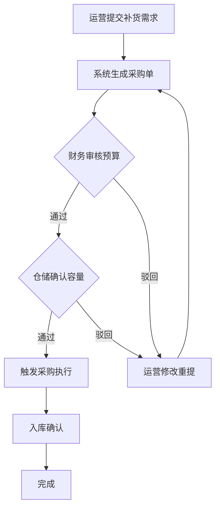

## 1. 产品概述

全渠道订单聚合与智能运营自动化平台，面向中大型零售与电商企业，一站式解决多渠道订单管理、智能推荐、库存预测、自动化营销与数据决策难题。通过统一数据池整合自营商城、社交平台、第三方分销渠道的订单与浏览行为，利用AI引擎驱动精细化运营，支撑日均百万级订单处理，助力企业实现降本增效与营收增长。

## 2. 核心功能

### 2.1 用户角色

| 角色 | 注册方式 | 核心权限 |
|------|----------|----------|
| 超级管理员 | 系统预置 | 全局数据查看、全部功能配置、用户权限管理 |
| 区域经理 | 管理员创建 | 本区域订单/用户数据查看、区域运营配置 |
| 运营专员 | 管理员创建 | 营销活动配置、订单处理、规则引擎配置 |
| 财务审核 | 管理员创建 | 采购预算审核、财务报表查看 |
| 仓储管理员 | 管理员创建 | 库存确认、入库管理、补货执行 |

### 2.2 功能模块

1. **实时数据看板**：多渠道GMV趋势、退货率分析、库存周转指标、异常预警中心
2. **订单中心**：全渠道订单聚合、数据清洗校正、订单详情、区域权限过滤
3. **智能推荐引擎**：推荐策略配置、实时浏览轨迹分析、个性化排序效果、A/B测试对比
4. **库存与采购**：库存预测（时序分析+节庆因子）、自动补货建议、多级采购审批流
5. **自动化营销**：用户生命周期分层（新客/活跃/沉睡/流失）、营销触达序列编排、转化归因报表
6. **规则引擎**：图形化自动化规则配置（自动调价、自动补货、自动对账）、版本留痕
7. **权限管理**：多级权限矩阵、数据行级权限、按钮可见性控制、操作审计日志

### 2.3 页面详情

| 页面名称 | 模块名称 | 功能描述 |
|----------|----------|----------|
| 登录页 | 身份认证 | 账号密码登录、角色自动识别、登录态保持 |
| 数据看板 | GMV总览 | 今日/本周/本月GMV、渠道占比饼图、同比环比趋势折线图 |
| 数据看板 | 运营指标 | 退货率、转化率、客单价、库存周转率多维卡片 |
| 数据看板 | 异常监控 | 异常规则列表、实时告警推送、告警处理记录 |
| 订单中心 | 订单列表 | 多渠道订单聚合展示、高级筛选（渠道/区域/状态/时间）、批量操作 |
| 订单中心 | 订单详情 | 订单全链路信息、用户画像、商品明细、物流轨迹 |
| 推荐引擎 | 策略配置 | 推荐算法权重调节、冷启动策略、实时浏览行为捕获 |
| 推荐引擎 | 效果分析 | CTR/CVR指标、推荐位曝光/点击热力图、渠道对比 |
| 库存管理 | 库存预测 | 未来30天销量预测曲线、节庆因子影响、安全水位线 |
| 库存管理 | 采购审批 | 补货建议列表、多级审批流程、版本对比、驳回重审 |
| 营销中心 | 用户分层 | 生命周期分布、RFM模型、人群圈选 |
| 营销中心 | 自动化流程 | 可视化流程编排、触达节点配置、A/B测试分组 |
| 规则引擎 | 规则配置 | 图形化规则画布、触发条件+执行动作配置、规则测试运行 |
| 系统设置 | 权限管理 | 角色权限矩阵、数据行级权限配置、用户管理 |
| 系统设置 | 操作日志 | 全链路操作审计、筛选查询、导出报表 |

## 3. 核心流程

### 3.1 采购审批流程

运营专员基于库存预测结果提交补货需求 → 系统自动生成采购单草稿 → 财务审核预算（通过/驳回并附带意见）→ 仓储确认入库容量（通过/驳回）→ 审批通过后触发采购执行 → 全流程版本留痕可追溯

### 3.2 自动化营销触达流程

用户行为触发 → 生命周期分层判断 → 匹配对应营销流程 → A/B测试分组 → 执行触达动作（短信/站内信/Push）→ 实时归因统计 → 效果回流优化策略

## 4. 用户界面设计

### 4.1 设计风格

- **主色调**：深邃科技蓝 `#1E3A5F` 搭配 活力橙 `#FF6B35` 作为强调色
- **辅助色**：成功绿 `#10B981`、预警红 `#EF4444`、警示黄 `#F59E0B`
- **中性色**：采用石板灰系 `slate-50 ~ slate-900`，深色主体背景配浅色卡片
- **按钮风格**：微圆角（rounded-lg）、悬停微浮起、点击按压反馈
- **字体**：标题采用 Space Grotesk，正文采用 Inter，数字采用 JetBrains Mono 等宽字体
- **布局风格**：左侧导航栏 + 顶部状态栏 + 内容卡片网格，信息密度适中
- **图标风格**：Lucide React 线性图标，统一16px/20px尺寸
- **视觉氛围**：深色科技感主题，带微光效渐变、数据面板毛玻璃质感

### 4.2 页面设计概览

| 页面名称 | 模块名称 | UI元素 |
|----------|----------|--------|
| 数据看板 | GMV总览 | 大数字KPI卡片、渐变面积图、环形渠道占比图、动效数字滚动 |
| 数据看板 | 异常监控 | 告警卡片带脉冲动画、严重程度色阶标签、处理倒计时 |
| 订单中心 | 订单列表 | 斑马纹表格、渠道来源彩色标签、状态徽章、行悬停高亮 |
| 库存管理 | 库存预测 | 双Y轴折线图（实际+预测）、节庆标记线、安全水位带 |
| 营销中心 | 流程编排 | 可视化节点画布、拖拽连线、节点状态色阶 |
| 规则引擎 | 规则画布 | 条件-动作积木式组件、逻辑分支嵌套、实时预览 |

### 4.3 响应式设计

- 桌面端优先设计（≥1440px），优化1920px及以上大屏展示
- 平板端（768-1439px）：侧边栏可折叠，卡片自适应重排
- 移动端（<768px）：底部Tab导航，数据表格转卡片列表展示
- 触摸优化：点击区域≥44px，滑动手势支持横向滚动数据表格
