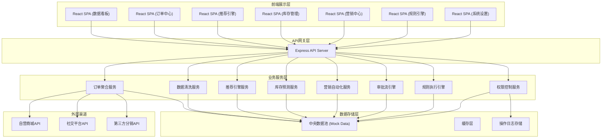
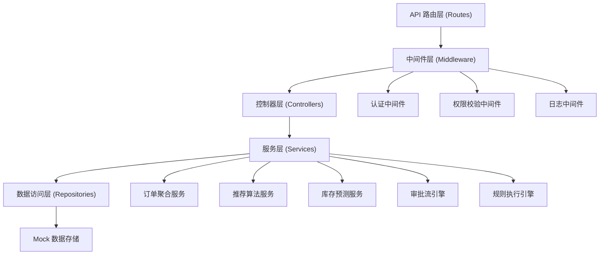
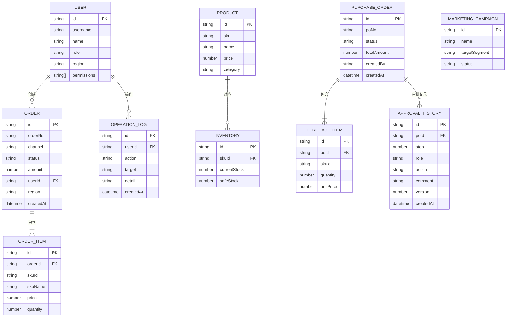

## 1. 架构设计



## 2. 技术选型说明

- **前端**：React@18 + TypeScript + Vite + TailwindCSS@3 + Zustand（状态管理）+ Lucide React（图标）+ Recharts（图表）
- **后端**：Express@4 + TypeScript + ESM模块化
- **数据层**：前端Mock数据模拟，后端内存数据存储
- **初始化工具**：vite-init (react-express-ts 模板)

## 3. 路由定义

| 路由 | 页面用途 |
|------|----------|
| /login | 登录页 |
| /dashboard | 实时数据看板（首页） |
| /orders | 全渠道订单列表 |
| /orders/:id | 订单详情页 |
| /recommendation | 智能推荐引擎配置 |
| /recommendation/analytics | 推荐效果分析 |
| /inventory | 库存预测看板 |
| /inventory/purchase | 采购审批流程 |
| /marketing | 用户生命周期分层 |
| /marketing/automation | 自动化营销流程编排 |
| /rules | 规则引擎配置画布 |
| /settings/permissions | 权限管理 |
| /settings/logs | 操作审计日志 |

## 4. API 接口定义

### 4.1 通用响应结构

```typescript
interface ApiResponse<T> {
  code: number;
  message: string;
  data: T;
  timestamp: number;
}
```

### 4.2 认证接口

```typescript
// POST /api/auth/login
interface LoginRequest {
  username: string;
  password: string;
}
interface LoginResponse {
  token: string;
  user: {
    id: string;
    name: string;
    role: 'super_admin' | 'region_manager' | 'operator' | 'finance' | 'warehouse';
    region?: string;
    permissions: string[];
  };
}
```

### 4.3 看板数据接口

```typescript
// GET /api/dashboard/overview
interface DashboardOverview {
  gmv: {
    today: number;
    week: number;
    month: number;
    yoy: number;
    mom: number;
    trend: { date: string; value: number }[];
  };
  channels: { name: string; value: number; color: string }[];
  metrics: {
    refundRate: number;
    conversionRate: number;
    avgOrderValue: number;
    inventoryTurnover: number;
  };
  alerts: AlertItem[];
}

interface AlertItem {
  id: string;
  type: 'critical' | 'warning' | 'info';
  title: string;
  description: string;
  channel?: string;
  createdAt: string;
  status: 'pending' | 'processing' | 'resolved';
  assignee?: string;
}
```

### 4.4 订单接口

```typescript
// GET /api/orders
interface OrderListRequest {
  page: number;
  pageSize: number;
  channel?: string;
  status?: string;
  region?: string;
  startDate?: string;
  endDate?: string;
  keyword?: string;
}
interface OrderListResponse {
  list: Order[];
  total: number;
  page: number;
  pageSize: number;
}

interface Order {
  id: string;
  orderNo: string;
  channel: 'self' | 'social' | 'distributor';
  channelName: string;
  status: 'pending' | 'paid' | 'shipped' | 'completed' | 'refunded' | 'cancelled';
  statusName: string;
  amount: number;
  userId: string;
  userName: string;
  userPhone: string;
  region: string;
  items: OrderItem[];
  createdAt: string;
  paidAt?: string;
  shippedAt?: string;
}

interface OrderItem {
  skuId: string;
  skuName: string;
  image: string;
  price: number;
  quantity: number;
}
```

### 4.5 库存预测接口

```typescript
// GET /api/inventory/forecast
interface InventoryForecast {
  skuId: string;
  skuName: string;
  currentStock: number;
  safeStock: number;
  forecast30d: { date: string; actual?: number; predicted: number }[];
  festivalFactors: { date: string; name: string; impact: number }[];
  suggestedReplenish: number;
}

// GET /api/inventory/purchase
interface PurchaseOrder {
  id: string;
  poNo: string;
  items: { skuId: string; skuName: string; quantity: number; unitPrice: number }[];
  totalAmount: number;
  status: 'draft' | 'finance_pending' | 'warehouse_pending' | 'approved' | 'rejected' | 'completed';
  currentApprover: string;
  approvalHistory: { step: number; role: string; user: string; action: string; comment?: string; createdAt: string; version: number }[];
  createdAt: string;
  createdBy: string;
}
```

### 4.6 营销接口

```typescript
// GET /api/marketing/lifecycle
interface LifecycleDistribution {
  newCustomers: number;
  activeCustomers: number;
  dormantCustomers: number;
  churnedCustomers: number;
  trend: { date: string; new: number; active: number; dormant: number; churned: number }[];
}

// GET /api/marketing/campaigns
interface MarketingCampaign {
  id: string;
  name: string;
  targetSegment: string;
  status: 'draft' | 'running' | 'paused' | 'completed';
  channels: string[];
  abTest?: {
    enabled: boolean;
    groups: { name: string; allocation: number; metrics?: { impressions: number; clicks: number; conversions: number } }[];
  };
  createdAt: string;
}
```

## 5. 服务端架构图



## 6. 数据模型

### 6.1 实体关系图



### 6.2 Mock数据初始化

所有数据通过后端服务生成Mock数据，包含：
- 5个测试用户（覆盖全部角色）
- 1000+条订单数据（覆盖3个渠道、6个区域、6种状态）
- 200+SKU库存数据与预测曲线
- 50+采购审批单与审批历史
- 20+营销活动与A/B测试数据
- 30+异常告警记录
- 完整操作审计日志
